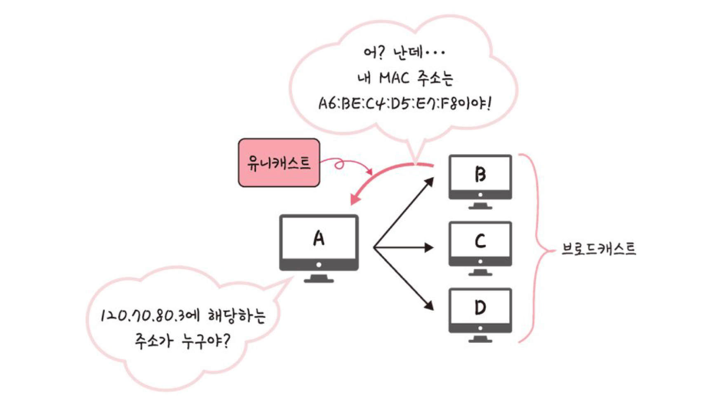
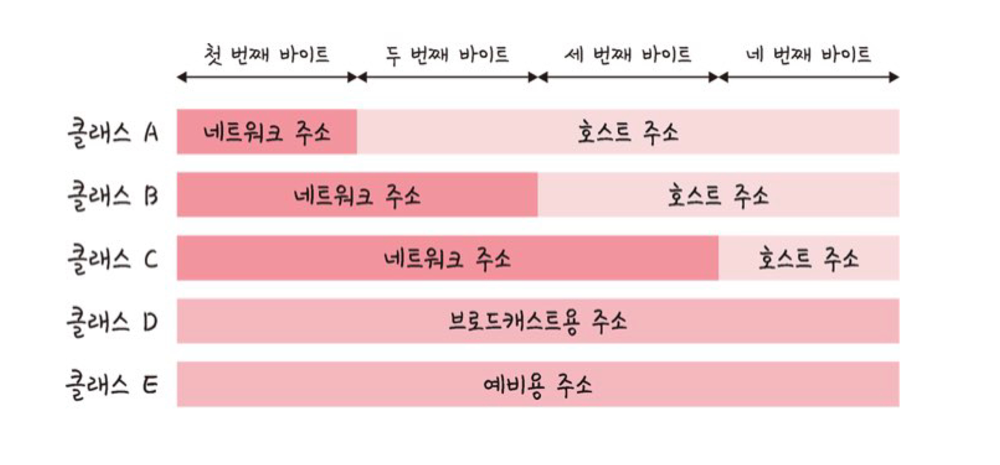

# 2. 네트워크

## ARP

### ARP란?

- **컴퓨터 간 통신 과정**에서 사용된다.
    - IP 주소에서 ARP를 통해 MAC 주소를 찾아 MAC 주소를 기반으로 통신한다.
    - 즉, APR은 가상 주소인 IP 주소로부터 실제 주소인 MAC 주소를 구하는 프로토콜
    - *+) RAPR은 반대로 MAC 주소를 IP 주소로 변환해줌*

### ARP의 주소를 찾는 과정

1. 장치 A가 ARP Request **브로드캐스트**를 보내서 특정 IP 주소에 해당하는 MAC 주소를 찾는다.
2. 해당 MAC 주소를 가진 장치 B가 ARP reply **유니캐스트**를 통해 MAC 주소를 반환한다.

<aside>

    브로드캐스트 : 송신 호스트가 전송한 데이터가 네트워크에 연결된 모든 호스트에 전송되는 방식

    유니캐스트 : 고유 주소로 식별된 하나의 네트워크 목적지에 1:1 로 데이터를 전송하는 방식

</aside>

## 홉바이홉 통신

### 홉바이홉 통신

- IP 주소를 통해 통신하는 과정
    - 각 패킷이 여러 개의 라우터를 건너가는 모습을 비유적으로 표현함

<aside>

    라우팅
    : IP 주소를 찾아가는 과정
    방법) 통신 장치의 라우팅 테이블의 IP를 통해 시작 주소에서 시작하여 다음 IP로 패킷 이동 … 이동 …

</aside>

- 라우팅을 통해 패킷이 최종 목적지까지 도달하는 통신이 홉바이홉 통신

### 라우팅 테이블

- 라우터에 들어가 있는 목적지 정보 + 목적지로 가기 위한 방법 이 담긴 리스트
- 게이트웨이 및 목적지 도달 위해 거쳐야 할 다음 라우터에 대한 정보 가지고 있다.

### 게이트웨이

- **서로 다른 통신망 및 프로토콜**을 쓰는 네트워크 간 통신을 가능케 하는 관문 역할의 컴퓨터나 소프트웨어
    - 통신 프로토콜을 변환해주는 역할을 하기도 함
- 사용자가 인터넷 접속하려면 수많은 게이트웨이를 거쳐야 한다
- 확인하는 방법 = 라우팅 테이블
    - 라우팅 테이블 → IPv4 경로 테이블, IPv6 경로 테이블
    - `netstat -r` : 라우팅 테이블 확인 명령어

## IP 주소 체계

### IPv4와 IPv6 차이점

- IPv4 → 현재 가장 많이 쓰임
    - 32비트를 8비트 단위로 표기
    - 점으로 구분된 숫자 4개로 이루어짐
- IPv6
    - 64비트를 16비트 단위로 표기
    - 콜론으로 구분된 숫자 6개로 이루어짐

### 클래스 기반 할당 방식

- IP 주소 체계 초기에 사용
- 앞 부분을 네트워크 주소, 뒷 부분을 호스트 주소(컴퓨터에 부여)로 사용

- A, B, C, D, E 다섯 개의 클래스로 구분
    - A, B, C는 일대일 통신으로 사용
    - D는 멀티캐스트 통신
    - E는 예비용
- 클래스마다 할당되는 범위가 다르다. (10진수)

    > 클래스 A : 0.0.0.0 ~ 127.255.255.255   
    > 클래스 B : 128.0.0.0 ~ 191.255.255.255  
    > 클래스 C : 192.0.0.0 ~ 223.255.255.255
    > 
    - 맨 왼쪽의 비트 (2진수)
        - = **구분**비트
        - 클래스간의 IP를 구분
        - A는 0, B는 10, C는 110
- 네트워크의 첫 번째 주소는 네트워크 주소로 사용
- 가장 마지막 주소는 브로드캐스트용 주소
    - 네트워크에 속한 모든 컴퓨터에 데이터 전송 시 사용

<aside>

    💡 e.g. 클래스 A로 12.0.0.0 의 네트워크를 부여받음
        = 12.0.0.1~12.255.255.254의 호스트 주소를 부여받음

        - 왜 12.0.0.0와 12.255.255.255 는 없나?
            - 전자는 네트워크 구별 주소
            - 후자는 브로드캐스트용으로 남겨두기
</aside>

- 버리는 주소가 많은 클래스 기반 할당 방식의 단점
    - 해결 위해 DHCP, IPv6, NAT 이 등장

### DHCP

Dynamic Host Configuration Protocol

- IP 주소 및 통신 매개변수를 자동으로 할당하기 위한 네트워크 관리 프로토콜
- 인터넷에 접속할 때마다 자동으로 IP 주소 할당된다.
- 대부분의 라우터와 게이트웨이 장비에 탑재됨

### NAT

Network Address Translation

- 패킷이 전송되는 동안 IP 주소 정보를 수정하여 IP 주소를 다른 주소로 매핑하는 것
- IPv4 주소로는 많은 주소들을 모두 감당하지 못함
    - NAT을 통해 공인 IP 와 사설 IP로 나눠서 처리한다.
- ICS, RRAS, Netfilter 등의 소프트웨어로 진행

<aside>

    💡 e.g. 각각 다른 IP(사설 IP)를 사용하고 있는 회사
    : NAT 장치를 통해 공인 IP 변환하여 외부 인터넷에 요청 가능

</aside>

- NAT 사용 목적
    - 여러 대의 호스트가 하나의 공인 IP 주소를 사용하여 인터넷에 접속하기 위해 → 여러 PC를 연결하여 사용하는 공유기 역시 NAT 기능 탑재됨
    - 외부에 드러나는 IP 주소를 다르게 유지할 수 있어 어느정도 보안 기능도 있음
- 단점
    - 여러 명이 동시에 접속하기 때문에 호스트 숫자에 따라 접속 속도가 느려질 수 있음

## IP 주소를 이용한 위치 정보

IP 주소는 네트워크 주소이기 때문에 위치 추적도 가능하다.