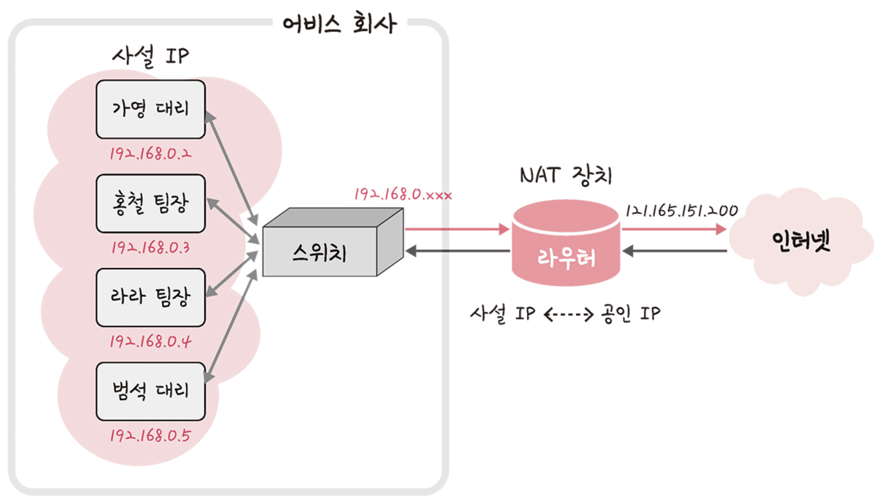

# IP 주소

# ARP

> `ARP(Address Resolution Protocol)`란 IP 주소로부터 MAC 주소를 구하는 IP와 MAC 주소의 다리 역할을 하는 프로토콜
> 
- 컴퓨터 간의 통신은 IP 주소에서 ARP를 통해 MAC 주소를 찾아 MAC 주소를 기반으로 통신
- ARP를 통해 가상 주소인 IP 주소를 실제 주소인 MAC 주소로 변환
- 장치 A가 ‘ARP Request 브로드캐스트’를 보내서 IP 주소에 해당하는 MAC 주소를 찾음 → 해당 주소에 맞는 장치 B가 ‘ARP reply 유니캐스트’를 통해 MAC 주소를 반환하는 과정을 거쳐 IP 주소에 맞는 MAC를 찾게 됨

```
💡 브로드캐스트

송신 호스트가 전송한 데이터가 네트워크에 연결된 모든 호스트에 전송되는 방식

```

```
💡 유니캐스트

고유 주소로 식별된 하나의 네트워크 목적지에 1:1로 데이터를 전송하는 방식

```

# 홉바이홉(hop by hop) 통신

> 통신 장치에 있는 ‘라우팅 테이블’의 IP를 통해 시작 주소부터 시작하여 다음 IP로 계속해서 이동하는 ‘라우팅’ 과정을 거쳐 패킷이 최종 목적지까지 도달하는 통신
> 
- 수많은 서브네트워크 안에 있는 라우터의 라우팅 테이블 IP를 기반으로 패킷을 전달하고 또 전달해나가며 라우팅을 수행하며 최종 목적지까지 패킷을 전달

```
💡 라우팅

IP 주소를 찾아가는 과정

```

## 라우팅 테이블

> `라우팅 테이블(routing table)`은 송신지에서 수신지까지 도달하기 위해 사용되며 라우터에 들어가 있는 목적지 정보들과 그 목적지로 가기 위한 방법이 들어 있는 리스트를 뜻함
> 
- 라우팅 테이블에는 게이트웨이와 모든 목적지에 대해 해당 목적지에 도달하기 위해 거쳐야할 다음 라우터의 정보를 가지고 있음

## 게이트웨이

> `게이트웨이(gateway)`는 서로 다른 통신망, 프로토콜을 사용하는 네크워크 간의 통신을 가능하게 하는 관문 역할을 하는 컴퓨터나 소프트웨어를 두루 일컫는 용어
> 
- 사용자는 인터넷에 접속하기 위해 수많은 톨게이트인 게이트웨이를 거쳐야 함
- 게이트웨이는 서로 다른 네트워크상의 통신 프로토콜을 변환해주는 역할을 하기도 함

# IP 주소 체계

- IP 주소는 IPv4와 IPv6로 나뉨
    - IPv4는 32비트를 8비트 단위로 점을 찍어 표기
        - 예 : 123.45.67.89
    - IPv6은 16비트 단위로 점을 찍어 표기
        - 예 : 2001:db8::ff00:42:8329

## 클래스 기반 할당 방식(classful network addressing)

- A, B, C, D, E 다섯 개의 클래스로 구분
    - 클래스 A, B, C : 일대일 통신
    - 클래스 D : 멀티캐스트 통신
    - 클래스 E : 앞으로 사용할 예비용
- `구분 비트` : 맨 왼쪽에 있는 비트
    - 클래스 A : `0`
        - 가질 수 있는 IP 범위 : 00000000.00000000.00000000.00000000 ~ 01111111.11111111.11111111.11111111 (0.0.0.0 ~ 127.255.255.255)
    - 클래스 B : `10`
    - 클래스 C : `110`
1. 네트워크의 첫 번째 주소(x.0.0.0)는 `네트워크 주소`로 사용
2. 가장 마지막 주소(x.255.255.255)는 `브로드캐스트 주소`로 네트워크에 속해 있는 모든 컴퓨터에 데이터를 보낼 때 사용
3. 나머지(x.0.0.1 ~ x.255.255.254)는 컴퓨터에 부여할 수 있는 `호스트 주소`
- 사용하는 주소보다 버리는 주소가 많은 단점
    - 이를 해소하기 위해 DHCP와 IPv6, NAT가 나옴

## DHCP

> `DHCP(Dynamic Host Configuration Protocol)`는 IP 주소 및 기타 통신 매개변수를 자동으로 할당하기 위한 네트워크 관리 프로토콜
> 
- 네트워크 장치의 IP 주소를 수동으로 설정할 필요 없이 인터넷에 접속할 때마다 자동으로 IP 주소를 할당
- 많은 라우터와 게이트웨이 장비에 DHCP 기능이 있으며 이를 통해 대부분의 가정용 네트워크에서 IP 주소를 할당

## NAT

> `NAT(Network Address Translation)`는 패킷이 라우팅 장치를 통해 전송되는 동안 패킷의 IP 주소 정보를 수정하여 IP 주소를 다른 주소로 매핑하는 방법
> 
- IPv4 주소 체계만으로는 많은 주소들을 모두 감당하지 못하는 단점이 있는데, 이를 해결하기 위해 NAT으로 공인 IP와 사설 IP로 나눠서 많은 주소를 처리
- NAT을 가능하게 하는 소프트웨어는 ICS, RRAS, Netfilter 등이 있음



### 공유기와 NAT

- NAT를 쓰는 이유는 주로 여러 대의 호스트가 하나의 공인 IP 주소를 사용하여 인터넷에 접속하기 위함
- 인터넷 회선 하나를 개통하고 인터넷 공유기를 달아서 여러 PC를 연결하여 사용할 수 있는데, 이것이 가능한 이유는 인터넷 공유기에 NAT 기능이 탑재되어 있기 때문

### NAT를 이용한 보안

- NAT을 이용하면 내부 네트워크에서 사용하는 IP 주소와 외부에 드러나는 IP 주소를 다르게 유지할 수 있기 때문에 내부 네트워크에 대한 어느 정도 보안이 가능

### NAT의 단점

- NAT은 여러 명이 동시에 인터넷을 접속하게 되므로 실제로 접속하는 호스트 숫자에 따라서 접속 속도가 느려질 수 있음

# IP 주소를 이용한 위치 정보

- IP 주소는 인터넷에서 사용하는 네트워크 주소이기 때문에 이를 통해 동 또는 구까지 위치 추적이 가능