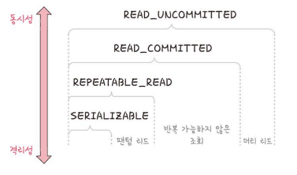

## 트랜잭션

- 데이터베이스에서 하나의 논리적 기능을 수행하기 위한 작업의 단위
- 즉, 쿼리를 하나로 묶는 단위
- ACID 특징을 가진다

### 원자성(A)

all or nothing

- 작업이 모두 수행되었거나 되지 않음을 보장하는 특징
    - e.g. 트랜잭션 커밋했는데, 롤백하는 경우 모든 작업이 수행되지 않은 상태여야 한다.
- 트랜잭션 단위로 로직들을 묶을 때 외부 API를 호출하는 게 있으면 안된다
    - 있는 경우, 롤백이 일어났을 때 해결 방법이 필요
    - 트랜잭션 전파 관리해야 함

**커밋과 롤백**

- 커밋
    - 여러 쿼리가 성공적으로 처리되었다고 확정하는 명령어
    - 트랜잭션 단위로 수행
    - 변경된 내용이 모두 영구적으으로 저장됨
- 롤백
    - 트랜잭션 전으로 상태를 돌려야 할 때 사용하는 명령어
- 둘을 통해 데이터의 무결성이 보장된다
- 변경 사항 쉽게 파악 가능 + 작업 그룹화 가능

**트랜잭션 전파**

- 트랜잭션은 커넥션 단위로 수행된다
- 따라서 커넥션 객체를 넘겨서 수행해야 함
- 매번 넘기기 귀찮아서 여러 메서드 호출을 하나의 트랜잭션에 묶는 것이 트랜잭션 전파
- Spring 프레임워크에서는 `@Transactional` 어노테이션 사용해서 묶는다

### 일관성(C)

- 허용된 방식으로만 데이터를 변경해야 한다.
- DB의 모든 데이터는 유효해야 한다.
    - e.g. 계좌에 500만원이 없는데 500만원을 이체할 수 없다.

### 격리성(I)

= 독립성

- 트랜잭션 수행 시 서로 끼어들지 못하는 것
    - 복수의 병렬 트랜지션은 순차적으로 실행되는 것처럼 작동되어야 한다
    - DB는 여러 사용자가 같은 데이터에 접근할 수 있어야 한다.
    
    → 실제로 순차적으로 진행하면 성능이 떨어진다.
    

- 어떻게 보장? 여러 개의 격리 수준으로 나눈다.
    
    
    
- 각 격리 수준의 동시성과 격리성은 반비례 관계
- SERIALIZABEL
    - 트랜잭션을 순차적으로 진행시키는 것
    - 여러 트랜잭션이 동시에 같은 행에 접근할 수 x → 매우 엄격
    - 교착 상태가 일어날 확률도 많고 가장 성능이 떨어짐
- REPEATABLE_READ
    - 하나의 트랜잭션이 수정한 행을 다른 트랜잭션이 수정할 수 x
    - 행 추가는 막지 않음
- READ_COMMITTED
    - 가장 많이 사용
    - 트랜잭션이 커밋하지 않은 정보는 읽을 수 x
    - 어떤 트랜잭션이 접근한 행을 다른 트랜잭션이 수정할 수 있다.
- READ_UNCOMMITTED
    - 가장 낮은 격리 수준
    - 커밋 이전에 다른 트랜잭션에 노출되는 문제가 있음
        - 데이터 무결성을 위해 사용하지 않는 게 이상적
        - 하지만 거대한 양의 데이터를 어림잡아 집계하는 데 사용하기 좋다.
    - 가장 빠르다

- 각 단계마다 발생하는 현상
    - REPEATABLE_READ는 팬텀 리드
    - READ_COMMITTED 는 팬텀 리드 + 반복 가능하지 않은 조회
    - READ_UNCOMMITTED는 팬텀 리드 + 반복 가능하지 않은 조회 + 더티 리드
    
- 팬텀 리드
    - 한 트랜잭션 내에서 동일한 쿼리를 보냈을 때 조회 결과가 서로 다른 경우
    - 다른 행이 선택될 수도 있다

- 반복 가능하지 않은 조회
    - 한 트랜잭션 내의 **같은 행**에 두 번 이상 조회가 발생했는데 그 값이 다른 경우
    - 행 값이 달라질 수 있다

- 더티 리드
    - 한 트랜잭션이 실행 중일 때, 다른 트랜잭션에 의해 수정되었지만 아직 커밋되지 않은 행의 데이터를 읽을 수 있는 경우

### 지속성(D)

- 성공적으로 수행된 트랜잭션은 영원히 반영되어야 한다.
- 시스템 장애가 발생해도 원래 상태로 복구하는 회복 기능이 있어야 함
- DB는 지속성을 보장하기 위해 체크섬, 저널링, 롤백 등의 기능 제공
    - 체크섬
        - 중복 검사의 한 형태
        - 오류 정정을 통해 송신된 자료의 무결성을 보호 → 단순한 방법
    - 저널링
        - 커밋 전에 로깅하는 것
        - 트랜잭션 등 변경 사항에 대해 로그를 남긴다.

## 무결성

### 무결성

- 데이터의 정확성, 일관성, 유효성을 유지하는 것
- 무결성이 있어야 DB의 값과 현실세계의 실제 값이 일치한다는 신뢰가 생긴다.

### 무결성의 종류

